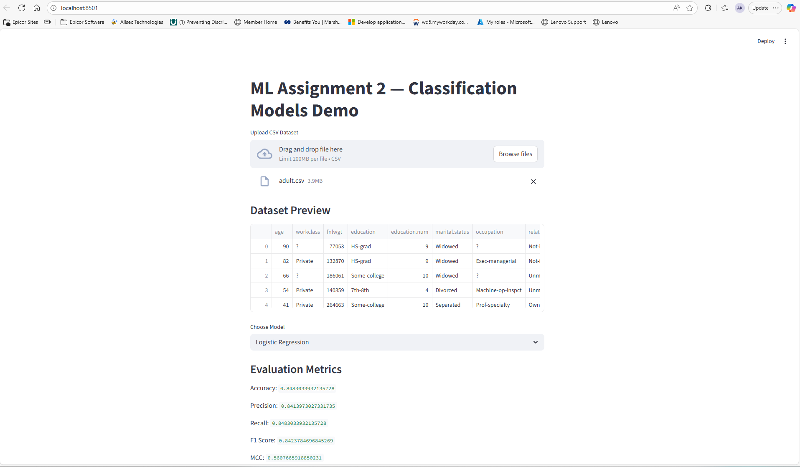

# ML Assignment 2: Interactive Classification Models with Streamlit

## Problem Statement
The goal of this project is to predict a target variable using various classification algorithms and compare their performance. The project demonstrates the practical implementation of machine learning concepts, including data preprocessing, model training, evaluation, and deployment.

## Dataset Description
The application supports any classification dataset uploaded by the user. For demonstration purposes, the Adult Census Income dataset is used:
- **Problem Type**: Binary Classification
- **Records**: ~48,000
- **Features**: 14 (numerical and categorical)
- **Target Variable**: `income` (<=50K or >50K)

### Feature Types
- **Numerical Features**: `age`, `fnlwgt`, `education-num`, `capital-gain`, `capital-loss`, `hours-per-week`
- **Categorical Features**: `workclass`, `education`, `marital-status`, `occupation`, `relationship`, `race`, `sex`, `native-country`

## Models Used
The following classification models are implemented:
1. Logistic Regression
2. Decision Tree Classifier
3. K-Nearest Neighbor Classifier
4. Naive Bayes Classifier
5. Random Forest (Ensemble)
6. XGBoost (Ensemble)

### Evaluation Metrics
Each model is evaluated using the following metrics:
- Accuracy
- AUC (Area Under the Curve)
- Precision
- Recall
- F1 Score
- Matthews Correlation Coefficient (MCC)

### Comparison Table
| ML Model Name       | Accuracy | AUC  | Precision | Recall | F1 Score | MCC  |
|---------------------|----------|------|-----------|--------|----------|------|
| Logistic Regression | 0.8483   | 0.8927 | 0.8414    | 0.8483 | 0.8424   | 0.5608 |
| Decision Tree       | 0.8141   | 0.7484 | 0.8151    | 0.8141 | 0.8146   | 0.4942 |
| K-Nearest Neighbor  | 0.7748   | 0.6757 | 0.7481    | 0.7748 | 0.7503   | 0.2923 |
| Naive Bayes         | 0.7918   | 0.8300 | 0.7708    | 0.7918 | 0.7608   | 0.3341 |
| Random Forest       | 0.8520   | 0.9004 | 0.8462    | 0.8520 | 0.8476   | 0.5759 |
| XGBoost             | 0.8712   | 0.9233 | 0.8667    | 0.8712 | 0.8674   | 0.6317 |

### Observations
| ML Model Name       | Observation about model performance |
|---------------------|-------------------------------------|
| Logistic Regression | Performed well with balanced metrics across all categories. |
| Decision Tree       | Slightly lower AUC and MCC compared to Logistic Regression. |
| K-Nearest Neighbor  | Lower performance overall, especially in MCC. |
| Naive Bayes         | Moderate performance with decent AUC but lower MCC. |
| Random Forest       | Strong performance with high AUC and balanced metrics. |
| XGBoost             | Best overall performance with the highest AUC and MCC. |

## Deployment
The application is deployed on Streamlit Community Cloud. Access the live app [https://mlassignment2025aa05105-gwsyduvptkvvemqbxspunq.streamlit.app/](#).

## How to Run Locally
1. Clone the repository.
2. Install dependencies: `pip install -r requirements.txt`
3. Run the app: `streamlit run app.py`

## Screenshots
